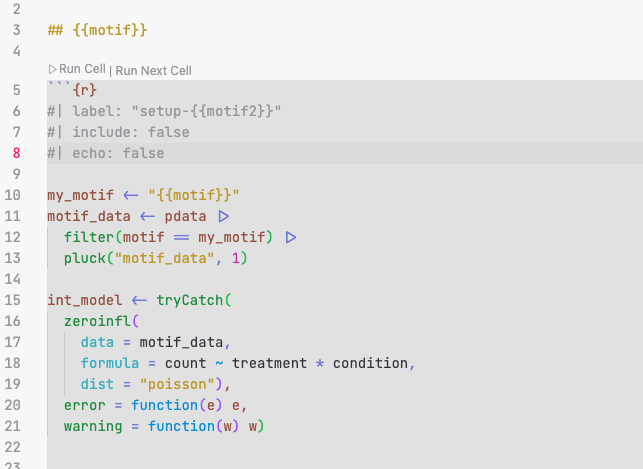
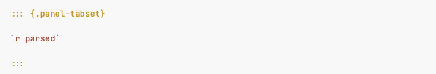
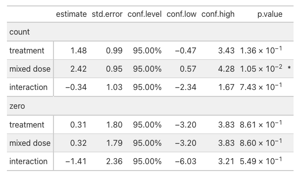

# what is quarto?

## A bad why of pronouncing 4? {background-image="https://media2.giphy.com/media/v1.Y2lkPTc5MGI3NjExMjhneWx2amVhcnRmODRwNHhqejMyd3l6YTc0eTcydHZucGttZm43biZlcD12MV9pbnRlcm5hbF9naWZfYnlfaWQmY3Q9Zw/IrJlMuk9wKalMiwvC9/giphy.gif" background-size="1000px"}

# why quarto?

::: {.incremental}

- we had used rmarkdown or variations for a while

- it works with other languages: `Python`, `Julia`, ...

- it allows to render many things: 

    - books
    - websites
    - manuscripts

- mostly because the notation is **cleaner**

:::

## quarto notation I

Instead of adding everything inside the header '```{r}' header, it looks like:

```{r}
#| label: "test-plot"
#| include: true
#| echo: "fenced"
#| eval: false

library(magrittr)
library(tidyverse)
library(ggplot2)

tibble(x = rnorm(20), y = rnorm(20)) |>
  ggplot(aes(x, y)) +
    geom_point()


```

::: {.incremental}

`echo: "fenced"` gives the code blocks like that

:::

## quarto notation II

modifications to the output is done within `:::`, for example tabs:

```
::: {.panel-tabset}

## Element 1

## Element 2

:::
```

revealing slide points incrementally:


```

::: {.incremental}

 point 1

 point 2

:::
```


## callouts

Using something like:

```

::: {.callout-important}

# Important message

The results ....

:::

```

yields:

::: {.callout-important}

# Important message

The results ....

:::


# add html files inside your document

::: {.incremental}

- For example to add slides or MultiQC reports into the documents

:::

## add html files inside your document


### In the yaml header

```
---
resources:
  - "path/to/multiqc_report.html"
---
```

### In a chunk

```{r}
#| label: "multiqc-report"
#| echo: "fenced"
#| eval: false

knitr::include_url("path/to/multiqc_report.html",
  height = "720px")

```

---

It looks as in: <https://ong-research.github.io/SatTCR/cases/canine_tcr/qc.html>


```{r}
#| label: "actual-report"
#| include: true

knitr::include_url("https://ong-research.github.io/SatTCR/cases/canine_tcr/qc.html", height = "720px")

```


# using templates with quarto

::: {.incremental}

- used when a task is repeated many times, and want the same plot / analysis for many elements

- it is done in 3 steps

:::

## step 1: render function

```{r}
#| label: "setup-motif"
#| include: true
#| echo: "fenced"
#| eval: false


render_file <- function(motif) {

  res = knitr::knit_expand(
    file = "template_motif.qmd",
    motif = motif,
    motif2 = snakecase::to_snake_case(motif))
  res

}

unparsed <- map(pdata$motif, render_file)

```

## the template file looks as

{width="90%"}

## step 2: parse the template

```{r}
#| label: "setup-motif-p2"
#| include: true
#| echo: "fenced"
#| eval: false


unparsed <- map(pdata$motif, render_file)
parsed <- knitr::knit_child(text = unlist(unparsed),
   envir = rlang::env(
    pdata = pdata
  ))    

```

## step 3: evaluate the code in the main document

{width="75%"}

::: {.incremental}
In summary:

- step 1: replaces the "motif" word, wherever it says "{{motif}}"
- step 2: added `pdata` into the environment that is evaluated in the template
- step 3: parse the results


:::

# gt

{width="90%"}

## gt: <https://gt.rstudio.com/>

{width="90%"}


## gt example:

```{r }
#| label: "model-example"
#| include: true
#| echo: "fenced"
#| eval: false


  int_model |>
    tidy_zeroinfl() |>
    mutate(
      component = if_else(component == "conditional", "count", "zero")) |>
    filter(term != "(Intercept)") |>
    select(- df.error, - original_term, -statistic) |>
    mutate(
      term = case_when(
        term == "treatmenttreat" ~ "treatment",
        term == "conditionB16_mixed" ~ "mixed dose",
        TRUE ~ "interaction")) |>
    gt::gt(
      groupname_col = "component", rowname_col = "term") |>
      gt::fmt_number(one_of(c("estimate", "std.error"))) |>
      gt::fmt_number(starts_with("conf")) |>
      gt::fmt_percent("conf.level") |>
      gt::fmt_scientific("p.value") |>
      gt::cols_add(
        psgn = if_else(p.value <= 0.05, "*", "")) |>
      gt::cols_label(psgn = "")

```

## gt example:

{width="85%"}

::: {.incremental}

- this is a small table: for larger tables [`opt_interactive`](https://gt.rstudio.com/reference/opt_interactive.html) can allow for multiple pages

:::

# reproducible documents with targets


# your own website

```{r}
#| label: "my-site"

knitr::include_url("https://renewelch.me", height = "400px")

```


# gifs in quarto


# ~~gifs in quarto~~

# how to add cats in quarto

## with extensions

To get this cat:



1. Install the fontawesome quarto extension: <br>`quarto add quarto-ext/fontawesome`


2. Write ` {{ < fa cat size=5x > } }` 


<https://github.com/quarto-ext/fontawesome>

other extensions: <https://quarto.org/docs/extensions/>


## with images and knitr

### find a cat image

```{r}
#| label: "cat-git1"
#| include: true
#| echo: false

knitr::include_url("https://giphy.com/gifs/computer-cat-wearing-glasses-VbnUQpnihPSIgIXuZv",
  height = "600px")
```

- open image in new tab
- copy link of new image

## with images and knitr

::: {.panel-tabset}

## Code

```{r}
#| label: "cat-git2"
#| include: true
#| echo: "fenced"
#| eval: false

knitr::include_url("https://i.giphy.com/VbnUQpnihPSIgIXuZv.webp", height = "600px")

```

## Cat

```{r}
#| label: "cat-git3"
#| include: true
#| echo: false
#| eval: true

knitr::include_url("https://i.giphy.com/VbnUQpnihPSIgIXuZv.webp", height = "600px")

```


:::

## extra materials from people who know more than me

1. Quarto authoring webinar <https://jthomasmock.github.io/quarto-2hr-webinar/>

2. Stephen Turner's blog <https://blog.stephenturner.us/p/quarto-books>

3. Quarto's gallery <https://quarto.org/docs/gallery/>

4. Using python and R together <https://nrennie.rbind.io/blog/combining-r-and-python-with-reticulate-and-quarto/>

## other tricks? {background-image="https://i.giphy.com/xTk9ZP2IPCyHl1JSP6.webp" background-size="100%"}


