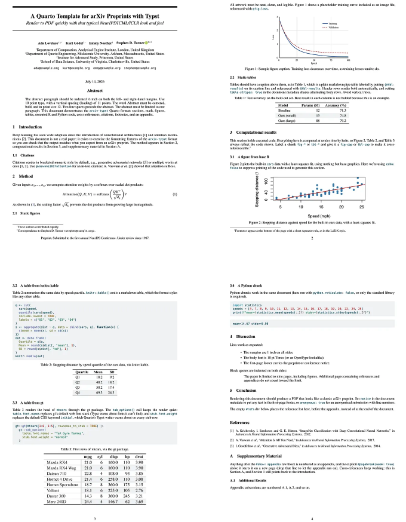
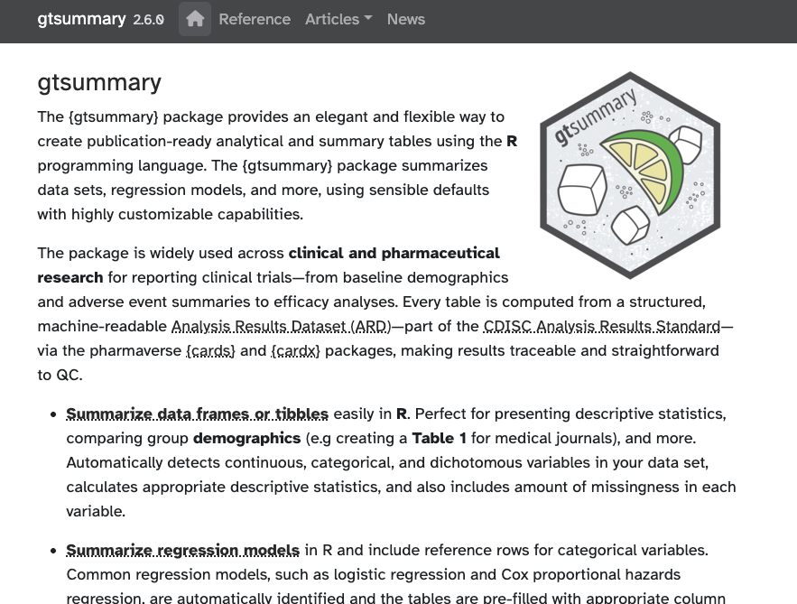

```{r}
#| label: "setup"
#| include: false
#| echo: false 
#| eval: true

library(ggplot2)

theme_set(
  theme(
    axis.text = element_text(size = 14),
    axis.title = element_text(size = 18)
  )
)

```

# [Back in my day]{style="color:white;"} {background-image="images/old-man-cloud-HD-1079x720.jpg" text-color="white"}

::: {style="color:white;"}

* We used [**rmarkdown**](https://rmarkdown.rstudio.com/){style="color:white;"}

* There was one package for each different task:

    * documentation sites

    * blogs

    * books

    * manuscripts

* The syntax was different depending on the task

:::

# [What is Quarto?]{style="color:white;"} {background-image="https://media2.giphy.com/media/v1.Y2lkPTc5MGI3NjExMjhneWx2amVhcnRmODRwNHhqejMyd3l6YTc0eTcydHZucGttZm43biZlcD12MV9pbnRlcm5hbF9naWZfYnlfaWQmY3Q9Zw/IrJlMuk9wKalMiwvC9/giphy.gif" background-size="100%"}


## What is Quarto?

<https://quarto.org>

::: {.incremental}

Quarto is an open-source scientific and technical publishing system that builds on standard markdown with features essential for scientific communication.

* Computations: Python, R, Julia, Observable JS
* Markdown: Pandoc flavored markdown with many enhancements
* Output: Documents, presentations, websites, books, blogs

:::

. . .

Literate programming system in the tradition of Org-Mode, Weave.jl, R Markdown, iPyPublish, Jupyter Book, etc.

# Quarto notation

## Header in a single Quarto file

For single documents (like these slides for example), a `yaml` header is required; the header contains 

```yaml
---
title: "Using Quarto for bioinformatics reporting"
author: "Rene Welch<br>CISR / onglab / UW Madison"
date: 2026-09-01
format:
  revealjs:
    theme: [slides.scss]
    multiplex: true
    transition: fade
    chalkboard: true
    footer: <a href="https://renewelch.me/talks/using_quarto">renewelch.me</a>
    auto-stretch: false    
resource-path: 
  - "images"
---
```

. . . 

without header, it still works though, but the general behaviour can be configured this way.


## Quarto chunks

Generally speaking, a Quarto document is composed in two parts; the "chunks" like the one below, and the text that works with markdown syntax.

```{r}
#| echo: "fenced"
#| eval: false

library(magrittr)
library(tidyverse)
library(ggplot2)

tibble(x = rnorm(200), y = rnorm(200)) |>
  ggplot(aes(x, y)) +
    geom_point() + 
    coord_fixed()


```

::: {.incremental}

`echo: "fenced"` gives the code blocks like that;

`eval: false` is to not evaluate it.

:::

## 

The chunks are run from top to bottom, and for example the code above will return the plot:

```{r}
#| label: "test-plot2"
#| include: true
#| echo: false
#| eval: true

library(magrittr)
library(tidyverse)
library(ggplot2)

tibble(x = rnorm(200), y = rnorm(200)) |>
  ggplot(aes(x, y)) +
    geom_point() + 
    coord_fixed()


```

. . .

I am using R here, but Quarto allows other languages like Python or Julia.

## Quarto chunks behavior

::: {.incremental}

- `label` is the name, can be used to reference plots / tables generated in the chunk.

- `execute` properties:

    - `include` whether the elements generated in the chunk appear in the document

    - `echo` whether to add the code in the documents

    - `eval` whether to evaluate the code

- `fig-width` and `fig-height` the size of the figure if one is being generated

- `out-width` how wide the figure, e.g. `out-width: "100%"` to use all the available space

:::


## Adding tabs to a html document

Modifications to the output is done within `:::`

```
::: {.panel-tabset}

## Histogram

## Density

:::
```

::: {.panel-tabset}

## Histogram

```{r}
#| label: "fig-histogram"

tibble(x = rnorm(2000)) |>
  ggplot(aes(x)) +
    geom_histogram(bins = 51)

```


## Density

```{r}
#| label: "fig-histogram-w-density"

tibble(x = rnorm(2000)) |>
  ggplot(aes(x)) +
    geom_histogram(bins = 51, aes(y = after_stat(density))) +
    stat_function(fun = dnorm, args = list(mean = 0, sd = 1),
      colour = "red", linewidth = 2)


```

:::

## Making callouts in the text

Using something like:

```

::: {.callout-important}

# Important message

The results ....

:::

```

yields:

::: {.callout-important}

# Important message

The results ....

:::

## Diagrams within Quarto

```{dot}
//| label: "directed-graphs"
//| echo: "fenced"
//| eval: true
//| include: true
digraph {
  rankdir=LR
  X -> M
  X -> Y
  M -> Y
}
```


## Diagrams within Quarto

```{dot}
//| label: "graphs"
//| echo: "fenced"
//| eval: true
//| include: true
graph {
  rankdir=LR
  A -- B
  B -- C
  A -- C
}
```


## Add html files inside your document


### In the yaml header

```
---
resources:
  - "path/to/multiqc_report.html"
---
```

### In a chunk

```{r}
#| label: "multiqc-report"
#| echo: "fenced"
#| eval: false

knitr::include_url("path/to/multiqc_report.html",
  height = "720px")

```

---

It looks as in: <https://ong-research.github.io/SatTCR/cases/canine_tcr/qc.html>


```{r}
#| label: "actual-report"
#| include: true

knitr::include_url("https://ong-research.github.io/SatTCR/cases/canine_tcr/qc.html", height = "720px")

```


# Using templates with Quarto

::: {.incremental}

- used when a task is repeated many times, and want the same plot / analysis for many elements

- it is done in 3 steps

:::

## Step 1: Render function

```{r}
#| label: "setup-motif"
#| include: true
#| echo: "fenced"
#| eval: false


render_file <- function(motif) {

  res = knitr::knit_expand(
    file = "template_motif.qmd",
    motif = motif,
    motif2 = snakecase::to_snake_case(motif))
  res

}

unparsed <- map(pdata$motif, render_file)

```

## The template file looks as

{width="90%"}

## Step 2: parse the template

```{r}
#| label: "setup-motif-p2"
#| include: true
#| echo: "fenced"
#| eval: false


unparsed <- map(pdata$motif, render_file)
parsed <- knitr::knit_child(text = unlist(unparsed),
   envir = rlang::env(
    pdata = pdata
  ))    

```

- `unparsed` is a list of strings with the tabs in a each entry

- `parsed` has the evaluated code with plots and stuff

## Step 3: evaluate the code in the main document

{width="75%"}


In summary:

- Step 1: replaces the "motif" word, wherever it says "{{motif}}"
- Step 2: added `pdata` into the environment that is evaluated in the template
- Step 3: parse the results


::: {.callout-warning}

## Warning

Even though the code seems to be running in parallel, this just writes the code and evaluate it from top to bottom, therefore we need to be careful of not re-writing data that is going to be used downstream

:::


I wrote the instructions [in my blog too](https://renewelch.me/posts/2025-05-21-using-knitr-with-templates/) or the better version done in an R package [by Danielle Navarro](https://blog.djnavarro.net/posts/2025-07-05_quarto-syntax-from-r/)

## Rendering pdf documents with typst

- **typst** is a new markup-based typesetting system that is designed to be as powerful as LaTeX while being much easier to learn and use

- Many templates are already available [here](https://quarto.org/docs/output-formats/typst-custom.html)

- It is seamless to install (for example [academic-typst](https://github.com/kazuyanagimoto/quarto-academic-typst)):

```sh
## Install within quarto
quarto install extension kazuyanagimoto/quarto-academic-typst

## Use the template in a folder
quarto use template kazuyanagimoto/quarto-academic-typst
```

{width=60%}

## arxiv format with Quarto / typst

- <https://blog.stephenturner.us/p/quarto-extension-arxiv-with-typst>

{width="70%"}

## your own website


```{r}
#| label: "my-site"

knitr::include_url("https://renewelch.me", height = "800px")

```

# gifs in Quarto

# ~~gifs in Quarto~~

# how to add cats in Quarto

## with extensions

To get this cat:



1. Install the fontawesome quarto extension: <br>`quarto add quarto-ext/fontawesome`


2. Write ` {{ < fa cat size=5x > } }` 


<https://github.com/quarto-ext/fontawesome>

other extensions: <https://quarto.org/docs/extensions/>


## with images and knitr

### find a cat image

```{r}
#| label: "cat-git1"
#| include: true
#| echo: false

knitr::include_url("https://giphy.com/gifs/computer-cat-wearing-glasses-VbnUQpnihPSIgIXuZv",
  height = "600px")
```

- open image in new tab
- copy link of new image

## with images and knitr

::: {.panel-tabset}

## Code

```{r}
#| label: "cat-git2"
#| include: true
#| echo: "fenced"
#| eval: false

knitr::include_url("https://i.giphy.com/VbnUQpnihPSIgIXuZv.webp", height = "600px")

```

## Cat

```{r}
#| label: "cat-git3"
#| include: true
#| echo: false
#| eval: true

knitr::include_url("https://i.giphy.com/VbnUQpnihPSIgIXuZv.webp", height = "600px")

```


:::

# GT

{width="90%"}

## GT: <https://gt.rstudio.com/>

{width="90%"}


## GT example:

```{r }
#| label: "model-example"
#| include: true
#| #| echo: "fenced"
#| eval: false


  int_model |>
    tidy_zeroinfl() |>
    mutate(
      component = if_else(component == "conditional", "count", "zero")) |>
    filter(term != "(Intercept)") |>
    select(- df.error, - original_term, -statistic) |>
    mutate(
      term = case_when(
        term == "treatmenttreat" ~ "treatment",
        term == "conditionB16_mixed" ~ "mixed dose",
        TRUE ~ "interaction")) |>
    gt::gt(
      groupname_col = "component", rowname_col = "term") |>
      gt::fmt_number(one_of(c("estimate", "std.error"))) |>
      gt::fmt_number(starts_with("conf")) |>
      gt::fmt_percent("conf.level") |>
      gt::fmt_scientific("p.value") |>
      gt::cols_add(
        psgn = if_else(p.value <= 0.05, "*", "")) |>
      gt::cols_label(psgn = "")

```

## GT example:

{width="85%"}

::: {.incremental}

- this is a small table: for larger tables [`opt_interactive`](https://gt.rstudio.com/reference/opt_interactive.html) can allow for multiple pages

:::

## GTsummary

This package run the statistical model and sets the output in a publication ready table

{width="70%"}


## Additional materials from people who know more than me

1. Quarto authoring webinar <https://jthomasmock.github.io/quarto-2hr-webinar/>

2. Stephen Turner's blog <https://blog.stephenturner.us/p/quarto-books>

3. Quarto's gallery <https://quarto.org/docs/gallery/>

4. Using python and R together <https://nrennie.rbind.io/blog/combining-r-and-python-with-reticulate-and-quarto/>

5. Make pretty pdfs with typst <https://nrennie.rbind.io/blog/pdf-quarto/making-pdf-with-quarto-typst-latex/>

6. Parametrized reports in Quart <https://nrennie.rbind.io/r-medicine-2026-parameterized-reports/slides/slides.html>

7. Quarto and Python <https://thomasmock.quarto.pub/python/#/TitleSlide>


## other tricks? {background-image="https://i.giphy.com/xTk9ZP2IPCyHl1JSP6.webp" background-size="100%"}


